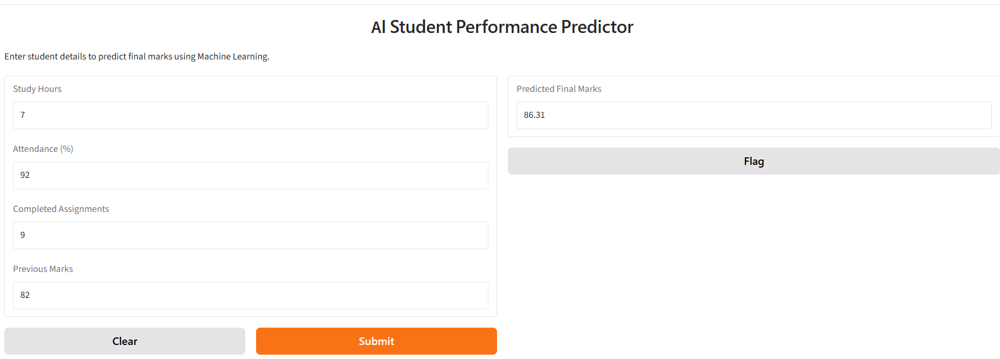

# 🎓 AI Student Performance Predictor

A Machine Learning project that predicts a student's final marks based on academic performance factors such as study hours, attendance, completed assignments, and previous marks.

## 📌 Project Overview

The goal of this project is to build a Machine Learning model that can estimate a student's final marks using basic academic performance data.

The project follows a complete Machine Learning workflow:

**Data Generation → Data Preparation → Train/Test Split → Model Training → Prediction → Model Evaluation → Model Comparison → Interactive Web Application**

## 📊 Features Used

The model uses the following input features:

- Study Hours
- Attendance (%)
- Completed Assignments
- Previous Marks

### 🎯 Target

**Final Marks**

## 🤖 Machine Learning Models

Two regression models were trained and compared:

1. Linear Regression
2. Random Forest Regressor

### 🏆 Final Model

**Linear Regression** performed better on the current dataset.

| Model | MAE | R² Score |
|---|---:|---:|
| Linear Regression | 5.00 | 0.68 |
| Random Forest | 5.74 | 0.53 |

### 📈 Model Interpretation

- Linear Regression achieved a Mean Absolute Error of approximately **5 marks**.
- The R² score of **0.68** indicates that the model explains a substantial portion of the variation in the test data.
- Random Forest performed lower than Linear Regression on this dataset.

> Note: R² Score should not be interpreted as prediction accuracy. The current dataset is a simulated dataset, so these results should not be treated as real-world performance.

## 🌐 Interactive Web Application

The project includes an interactive interface built using **Gradio**.

Users can enter:

- Study Hours
- Attendance
- Completed Assignments
- Previous Marks

The application then predicts the student's expected final marks.

## 🛠️ Technologies Used

- Python
- Pandas
- NumPy
- Scikit-learn
- Matplotlib
- Gradio
- Google Colab
- GitHub

## 📂 Project Structure

```text
AI-Student-Performance-Predictor/
│
├── AI_Student_Performance_Predictor.ipynb
├── README.md
└── gradio_app.png
